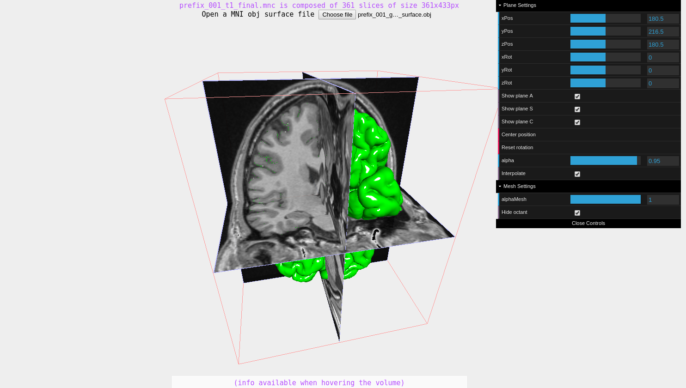

[→VIDEO HERE←](https://youtu.be/qjNuVnkR1V0)

Uses [Pixpipe.js](https://github.com/jonathanlurie/pixpipejs) and [ThreeJS](https://threejs.org/) to build and display a 3D texture of MRI neuro imaging. Then gives the possibility to display a MNIobj mesh on top of it and play with opacity.  
You can perform obliques.

This is not an end but rather some WebGL experiment.

Use the data in the `data` folder:
- `prefix_001_t1_final.mnc` : the volume file to load first
- `prefix_001_gray_surface.obj` : the mesh file to load then
